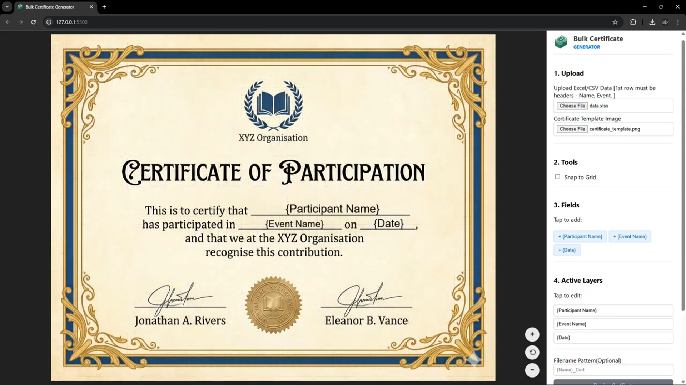

# 🎓 Bulk Certificate Generator


A powerful, **client-side** web application designed to help student organizers and teachers generate hundreds of participation certificates in minutes. 

It features a drag-and-drop interface, supports Excel/CSV uploads, and runs entirely in the browser—meaning **no server costs** and **100% data privacy** (student data never leaves the computer).

---

## 📱 Screenshots

| Desktop View | Mobile View |
|:---:|:---:|
|  |  |

---

## ✨ Key Features

* **🚫 Serverless:** Runs entirely on the client-side. No backend required.
* **📂 Excel/CSV Support:** Upload class lists or event registration data.
* **🎨 Drag & Drop Editor:** Visually place placeholders (e.g., `{Name}`) onto your certificate template.
* **📱 Mobile Responsive:** fully functional on mobile with **Zoom**, **Pan**, and a sticky canvas layout.
* **🔤 Typography:** Support for Google Fonts (Great Vibes, Roboto, Oswald, etc.), custom colors, and sizes.
* **📐 Smart Alignment:** Snap-to-grid and auto-centering tools for pixel-perfect layout.
* **🔒 Privacy Focused:** Data is processed locally in the browser RAM. No data is ever uploaded to a cloud server.
* **📦 Batch Export:** Generates high-resolution images and bundles them into a single `.zip` file.
* **✏️ Fallback Editing:** "Active Layers" list allows easy selection of elements even on small screens.

---

## 🛠️ Tech Stack

* **HTML5 & CSS3:** For a responsive, modern Grid/Flexbox layout.
* **JavaScript (ES6+):** Core logic.
* **[Fabric.js](http://fabricjs.com/):** For HTML5 Canvas manipulation (Drag, Drop, Resize, Touch Gestures).
* **[SheetJS (xlsx)](https://sheetjs.com/):** For parsing Excel and CSV files.
* **[JSZip](https://stuk.github.io/jszip/):** For zipping generated images in the browser.
* **[FileSaver.js](https://github.com/eligrey/FileSaver.js/):** For triggering the download.

---

## 🚀 How to Run Locally

Since this is a static site, you don't need to install Node.js, Python, or any heavy environment.

1.  **Clone the Repo**
    ```bash
    git clone https://github.com/eberjohns/bulk_certificate_generator.git
    ```
2.  **Open the Project**
    * Navigate to the folder.
    * Double-click `index.html` to open it in your browser.

    *> **Note:** For the best experience (and to avoid local CORS restrictions with some images), it is recommended to use a simple local server extension like "Live Server" in VS Code.*

---

## 📖 User Guide

1.  **Prepare Data:** Create an Excel file where the first row contains headers (e.g., `Name`, `Date`, `Event`).
2.  **Upload Data:** Click "Upload Excel/CSV" and select your file.
3.  **Upload Template:** Upload a blank certificate image (JPG/PNG).
4.  **Map Fields:**
    * Click the buttons that appear (e.g., `+ {Name}`).
    * Drag the text to the correct position on the certificate.
    * Use the **Properties Panel** to change the font to a handwriting style or change the color.
5.  **Preview:** Click "Preview Certificate" to see how real data looks.
6.  **Generate:** Click "Generate & Download Zip". The app will process the list and download a ZIP file.

---

## 📂 Project Structure

```text
bulk-cert-generator/
│
├── index.html       # The main structure and UI
├── style.css        # Responsive styling and Mobile layout logic
├── script.js        # Core logic (Fabric.js, looping, zip generation)
└── README.md        # Documentation
```

## 🤝 Contributing

Contributions are what make the open-source community such an amazing place to learn, inspire, and create. Any contributions you make are **greatly appreciated.**

## 👤 Author
Eber Johns C D

Github: https://github.com/eberjohns
LinkedIn: https://www.linkedin.com/in/eber-johns-c-d/


Tip: If you find this useful, please give it a ⭐️ on GitHub!

